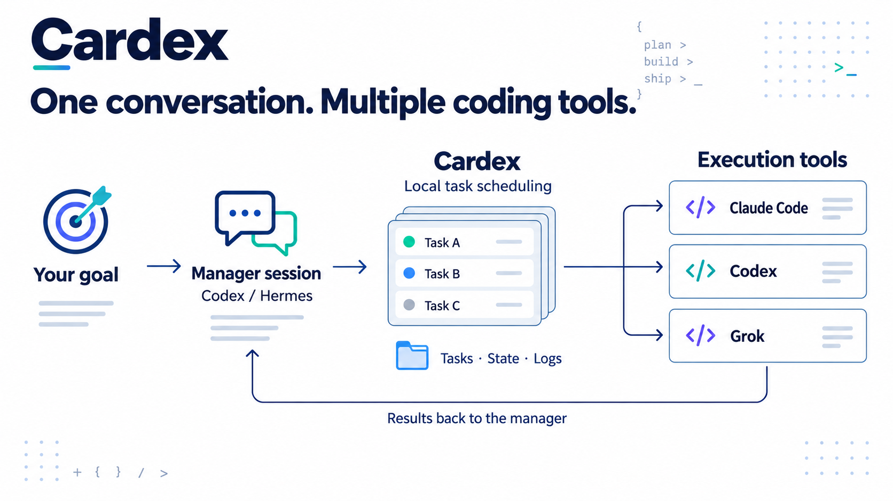
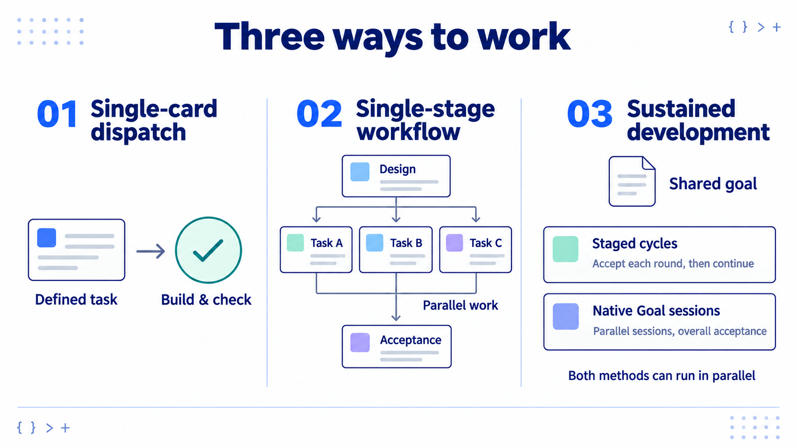
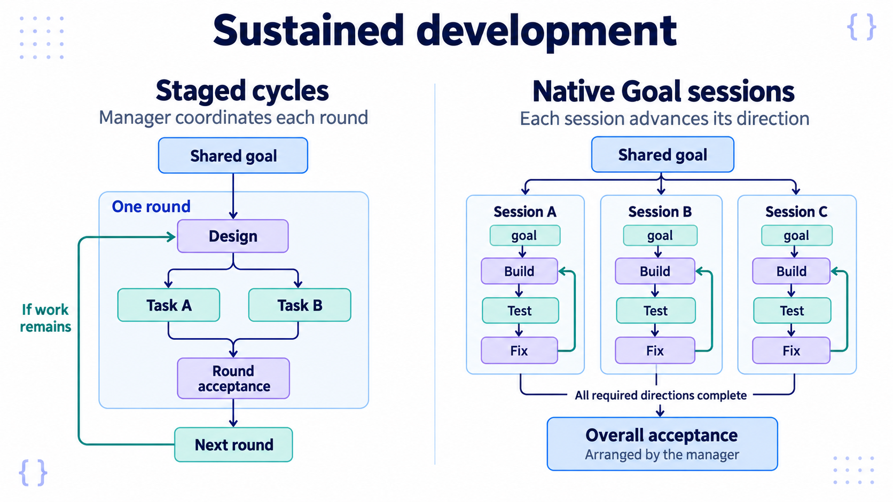
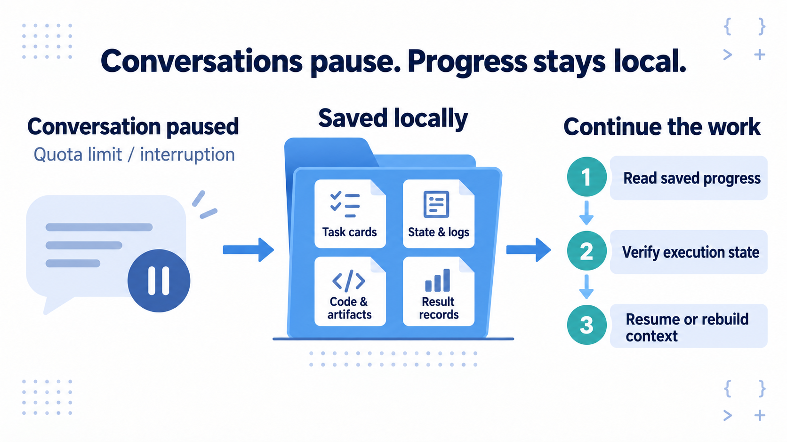

# Cardex

**Coordinate multiple AI coding tools from one management conversation. Keep your development goal moving.**

[中文](README.md) | **English** · [Download Release](https://github.com/OttoPrua/Cardex/releases/latest) · [Supported tools](#supported-tools-models-and-connections) · [Install](#install-and-get-started)



> **Cardex is a local development task scheduler.** The management Agent owns goals, decomposition and follow-up. Configured tools such as Claude Code, Codex and Grok execute the work; task records, state and logs stay on disk.
>
> **Use your subscriptions or APIs.** Inventory CLIs, authentication status and available models, then save routing presets after confirmation. Your choices take priority. The manager must be able to access the Cardex machine; cloud conversations need that connection first. Each tool uses its own subscription or API configuration.

## Install and get started

**Let an Agent deploy Cardex:** copy this request to a management Agent that can operate your machine. It will continue through installation and configuration:

```text
Install and configure Cardex using https://github.com/OttoPrua/Cardex/blob/main/docs/getting-started.md.
Read the installed cardex-dispatch skill and continue in this conversation.
Confirm which existing subscriptions or API services I want to use, help configure them, show routes based on
verified available models, and ask whether to adopt them before saving.
Recommend single-card dispatch, a single-stage workflow or sustained development based on
scope, dependencies and risk. Explain responsibilities and acceptance timing.
Keep simple work in one card; do not add multiple models or extra reviews by default.
Reuse existing configuration and queues. Do not stop at "installed".
```

> **Continue in the same conversation:** identify the manager and machine → inventory subscriptions / APIs → configure and verify → confirm routing → choose a working method for the task.
>
> The installer prints a handoff; the deploying Agent conducts the follow-up and orchestration. Sign in through each provider's own service. Do not paste passwords or secrets into chat.

**Manual installation:** run these commands on the machine that will run Cardex to install the binary and dispatch skill. macOS / Linux:

```sh
curl -fsSL https://github.com/OttoPrua/Cardex/releases/latest/download/install.sh -o /tmp/cardex-install.sh && sh /tmp/cardex-install.sh --manager codex
```

Windows PowerShell:

```powershell
& ([scriptblock]::Create((Invoke-RestMethod -ErrorAction Stop https://github.com/OttoPrua/Cardex/releases/latest/download/install.ps1))) -Manager codex
```

For Hermes, replace `codex` with `hermes`. After binary and skill installation, the manager continues subscription login, API configuration and model routing in the same conversation.

[Setup (中文)](docs/getting-started.md) · [Dispatch Agent, examples and skill (中文)](docs/dispatch-agent.md) · [Configuration](docs/config.en.md)

<details>
<summary>Try a first CLI task</summary>

After configuring and confirming a `routine` preset:

```sh
cardex presets
cardex add -preset routine -dry-run -dir . "Explain this project's entry point. Do not edit files."
cardex add -preset routine -dir . "Explain this project's entry point. Do not edit files."
cardex run TASK_ID   # ID returned by add; this calls a model
cardex log TASK_ID
cardex board
```

`-dry-run` does not save or execute a card. A running scheduler may start queued work immediately; use `add -hold` to prepare work. `run TASK_ID` targets one card; bare `run` processes the ready queue. Reuse existing configuration rather than replacing it with a starter.

</details>

## Supported tools, models and connections

> **Use subscriptions or APIs.** Cardex schedules configured coding CLIs rather than a single model vendor. Claude, GPT / Codex, Grok, Kimi, GLM, MiniMax, MiMo and DeepSeek families are accessible through the appropriate runner or engine profile. Exact model IDs, reasoning levels and quotas depend on the tool catalog and your account access.

| Adapted execution tool | Cardex runner | Models and connection path |
|---|---|---|
| **Claude Code** | `claude` | Claude models, using the CLI's configured subscription login or API credentials |
| **Codex CLI** | `codex` | GPT / Codex models, using the CLI's configured account or API provider |
| **Grok Build** | `grok-build` | Grok models and reasoning levels available in its CLI catalog |
| **Cursor Agent** | `cursor` | Models available to the Cursor account, including adapted Grok / Fable routes |
| **Kimi CLI** | `kimi-cli` | Kimi models, reusing its login and model configuration |
| **OpenCode** | `opencode` | Configured `provider/model` IDs, including OpenCode Go, Zen, third-party APIs or local model services |
| **Antigravity** | `agy` | Native `agy` execution; the current adapter selects an available Claude Opus and does not silently substitute Gemini / Sonnet when Opus is absent |

> **Built-in subscription / API engine presets:** Kimi Code (`kimi`), GLM Coding Plan (`glm-cn` / `glm-global`), MiniMax Coding Plan (`minimax-cn` / `minimax-global`), Xiaomi MiMo (`mimo`), OpenCode Go (`opencode-go`) and Ollama Cloud (`ollama`). These profiles use Claude Code with Anthropic-compatible endpoints and editable model mappings. List them with `cardex engines`; add one with `cardex engines add NAME`.
>
> **OpenCode is an execution tool; OpenCode Go is a service plan.** These are available adapters and configuration paths, not a claim that every model, plan and feature has been tested. Chat subscriptions do not automatically grant API / CLI access. The legacy `gemini` runner is retired.

### APIs and compatible formats

| API format | Connection path | Where to configure it |
|---|---|---|
| **Anthropic Messages compatible** | Cardex `engines` → Claude Code → API / gateway | Cardex engine profile: `base_url`, model mappings and `auth_env` or `auth_file` |
| **OpenAI Chat Completions compatible** (`/v1/chat/completions`) | Cardex → OpenCode → custom provider | Configure the compatible provider and endpoint in OpenCode; select `provider/model` in Cardex |
| **OpenAI Responses compatible** (`/v1/responses`) | Cardex → Codex CLI or OpenCode → configured provider | Configure the provider in that CLI; Codex uses `wire_api = "responses"`, while OpenCode needs the matching provider package |

> **Metered APIs, custom gateways and local model services are usable through a matching protocol and runner.** Cardex does not translate these three protocols or turn any URL in `engines` into a universal API connector. The model must also meet the runner's tool-calling and streaming requirements. Verify one small real task before expanding dispatch.

Configuration references: [Cardex configuration](docs/config.en.md) · [Engine implementation and presets](cmd/cardex/engines.go) · [OpenCode providers](https://opencode.ai/docs/providers/#custom-provider) · [Codex providers](https://developers.openai.com/codex/config-advanced/). Protocol documentation checked on 2026-09-28.

## Three ways to work



> **Assess complexity first. Start with an MVP.** Keep diagnosis, implementation, checks and ordinary fixes in one card for simple tasks. Do not add design cards, multiple models or extra reviewers by default.
>
> **Single-card dispatch:** one fix, script or independent change; check the result against its completion criteria.
>
> **Single-stage workflow:** one design card branches into execution cards. Once all required cards finish, one acceptance card checks the combined result.
>
> **Sustained development:** keep working toward one goal using either method below. Run independent work in parallel; serialize dependencies and conflicting writes. A card can contain multiple model and tool calls.

See the [workflow guide](docs/workflows.en.md). These are recommended practices organized by the management Agent using existing tasks, dependencies and workflow mechanisms.

## Sustained development: two dispatch methods



> **Staged cycles:** repeat design → execution cards → round acceptance. Move to the next round after acceptance passes, and stop when the goal is met. Keep ordinary fixes within the current bounded task.
>
> **Native Goal sessions:** one or more independent conversations continuously implement, test and fix their assigned directions. Once all required directions finish and terminal states are verified, gather the artifacts for one overall acceptance review. An individual session finishing does not mean the whole goal has passed.
>
> **Review the combined result.** Check completion criteria, interfaces and actual artifacts, with depth proportional to risk. Preserve completed work, fix specific issues and recheck affected parts. The two methods can be combined.

> **Current boundary:** the management Agent explicitly arranges orchestration and overall acceptance. The released version does not automatically collect all Goal completions and create an overall acceptance card. The dispatch skill's full mode and acceptance rules are also being refined. Native Goal requires actual support in the execution tool and adapter.

## Conversations pause. Saved progress stays local.



> **Keep and reuse saved work.** Cardex stores task records; execution Agents write code and artifacts to their working directories. Use `list`, `log` and `board` to inspect progress. Prefer change summaries and necessary files for routine follow-up.
>
> After a quota limit or unexpected exit, verify execution state before continuing through the runner's supported recovery path. Persistence helps recovery; it does not guarantee lossless resumption or preserve all internal model state. A new card need not require a new session, and session reuse does not guarantee a server-side cache hit.

## Planned dispatch automation

> **In development; not released as a complete capability.** Move confirmed preferences, session continuation and batch acceptance into program rules, reusing existing mechanisms and starting with the smallest working loop.

<details>
<summary>Session reuse, overall acceptance and lower management overhead</summary>

| Situation | Planned behavior |
|---|---|
| All required Goal directions complete | Gather current artifacts and evidence; create one overall acceptance card without duplicates. Running, paused, failed or unknown required work cannot count as completed. |
| Same stage and role continue implementation or fixes | Prefer a compatible, safely resumable session when the runner supports it. |
| Independent acceptance or review | Use a separate session with criteria and necessary artifacts, without the author's full reasoning history. |
| Tool, model or environment changes | Check compatibility; never pass a session ID across incompatible providers or silently change providers to preserve a cache. |
| Stage or context handoff | Continue from saved essential state at a safe boundary rather than restarting for every small step. |
| Manager follow-up | Return changes, evidence locations, blockers and next steps; notify on material changes or needed decisions. |
| Dispatch inspection | Show the selected mode, model and session decision with its reason; label missing usage as unknown. |

Task boundaries and session boundaries are separate choices. Persistence preserves work; server-side caching can reuse matching input computation. Optimize total cost and delivery quality without promising cache hits or fixed savings.

[Development checklist (中文)](docs/handoffs/cardex-context-dispatch-development.md)

</details>

## Support and development

> Releases cover **macOS, Linux and Windows**. Native Windows x64 CI is available; ARM64 artifacts have not been validated on a real device. Windows does not support hosted PTY Goal or automatic cross-runner fallback requiring strict process-exit proof. Verify subscriptions, CLIs and project tools in your own environment; see the [Windows guide (中文)](docs/windows.md).
>
> Scheduling and the board do not call models. Management, development and model-based review use the corresponding provider's quota. Data defaults to `~/.cardex`; select another root with `CARDEX_ROOT` or `-root`. Preserve existing queues during onboarding.

<details>
<summary>Build, checks and further documentation</summary>

Requires Go 1.24+:

```sh
go build -o cardex ./cmd/cardex  # Use cardex.exe on Windows
go test ./...
make test            # Bash integration checks with mock CLIs
```

[Advanced guide](docs/guide.en.md) · [Runtime internals](docs/internals.en.md) · [Mixed routing (中文)](docs/mixed-routing.md) · [Changelog](docs/changelog.en.md)

</details>

## License

[PolyForm Noncommercial 1.0.0](LICENSE) — **free for personal use, commercial use needs a license**.

- **No need to ask**: personal use, study and research, hobby projects, and use by charitable,
  educational, or public research organizations.
- **Needs a license**: internal production use at a company, using it to deliver paid client
  work, or shipping it (or a derivative) as part of a product or service. Open an
  [issue](https://github.com/OttoPrua/cardex/issues) describing the intended use.

Two caveats: this is **not** an OSI-approved open-source license (it restricts commercial use),
so don't wave it through your company's dependency compliance as "open source"; and versions
published before 2026-08-03 (through commit `b1ed92b`) remain MIT — that grant is irrevocable
for those versions, and this change applies only to what follows. See [LICENSE](LICENSE).

## Acknowledgements

This project is shared with the [LINUX DO](https://linux.do) community — thanks to everyone there for the feedback.
