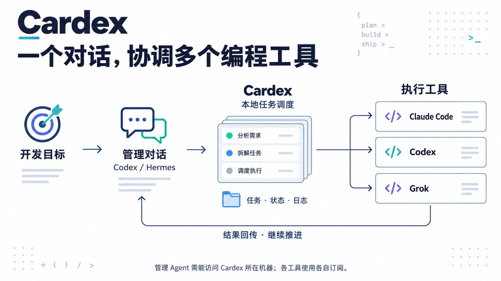
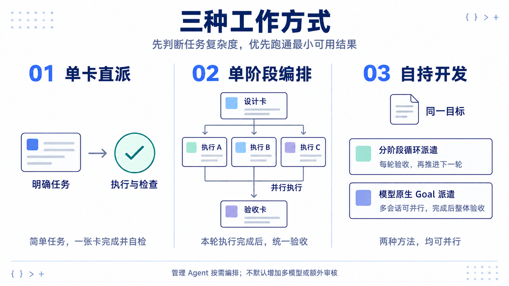
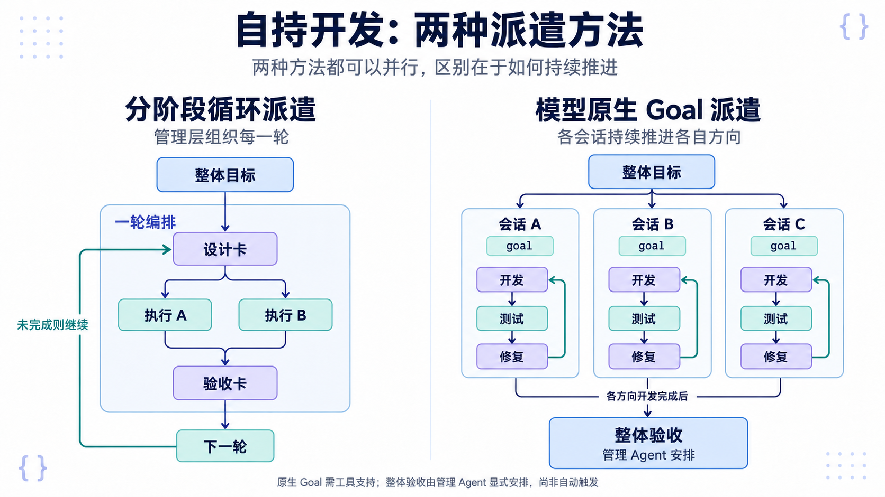
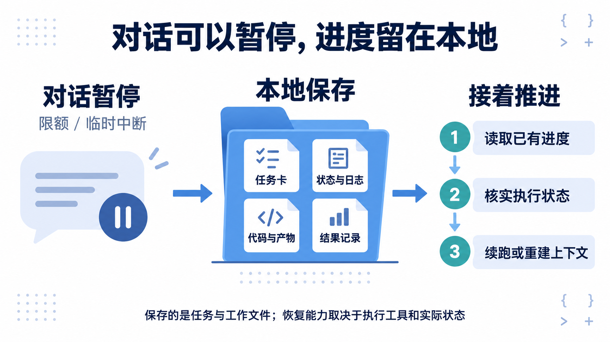

# Cardex

**通过一个管理对话，协调多个 AI 编程工具，把开发目标持续推进下去。**

**中文** | [English](README.en.md) · [下载 Release](https://github.com/OttoPrua/Cardex/releases/latest) · [支持范围](#支持的工具模型与接入方式) · [安装](#安装与新手引导)



> **Cardex 是本地开发任务调度器。** 管理 Agent 负责目标、拆分和跟进，已配置的 Claude Code、Codex、Grok 等工具负责执行；任务、状态与日志保存在本地。
>
> **复用订阅或 API。** 盘点 CLI、认证状态和可用模型，确认路由建议后保存预设，手动选择优先。管理 Agent 需要能访问 Cardex 所在机器；云端对话需先连接这台机器，各工具使用各自的订阅或 API 配置。

## 支持的工具、模型与接入方式

> **订阅和 API 都可以接入。** Cardex 调度已配置的编程 CLI，不限定为某一家模型。Claude、GPT / Codex、Grok、Kimi、GLM、MiniMax、MiMo、DeepSeek 等模型系列，可通过对应执行工具或引擎档案使用；具体模型 ID、思考强度和额度以工具目录与账户实际权限为准。

| 已适配的执行工具 | Cardex runner | 模型与接入范围 |
|---|---|---|
| **Claude Code** | `claude` | Claude 系列；使用 CLI 已配置的订阅登录或 API 凭据 |
| **Codex CLI** | `codex` | GPT / Codex 系列；使用 CLI 已配置的账户或 API provider |
| **Grok Build** | `grok-build` | Grok 系列，模型与思考强度以 Grok CLI 目录为准 |
| **Cursor Agent** | `cursor` | Cursor 账户可用目录中的模型，包括已适配的 Grok / Fable 路由 |
| **Kimi CLI** | `kimi-cli` | Kimi 系列，复用该 CLI 的登录和模型配置 |
| **OpenCode** | `opencode` | 已配置 provider 下的 `provider/model`；可使用 OpenCode Go、Zen、第三方 API 或本地模型服务 |
| **Antigravity** | `agy` | 原生 `agy` 接入；当前适配会从实际目录选择 Claude Opus，无 Opus 时不静默换成 Gemini / Sonnet |

> **内置订阅 / API 引擎预设：** Kimi Code（`kimi`）、GLM Coding Plan（`glm-cn` / `glm-global`）、MiniMax Coding Plan（`minimax-cn` / `minimax-global`）、小米 MiMo（`mimo`）、OpenCode Go（`opencode-go`）、Ollama Cloud（`ollama`）。这些预设通过 Claude Code 调用 Anthropic 兼容端点，可修改模型映射；用 `cardex engines` 查看、`cardex engines add NAME` 加入配置。
>
> **OpenCode 是执行工具，OpenCode Go 是服务方案，二者不是同一个接入口。** 上表表示已有适配与配置路径，不代表所有模型、套餐和功能均已实测。聊天订阅不自动包含 API / CLI 权限；旧的 `gemini` runner 已退休，不列为当前执行入口。

### API 与兼容格式

| 接口格式 | 接入路径 | 配置位置 |
|---|---|---|
| **Anthropic Messages 兼容** | Cardex `engines` → Claude Code → API / 网关 | Cardex 引擎档案：`base_url`、模型映射、`auth_env` 或 `auth_file` |
| **OpenAI Chat Completions 兼容**（`/v1/chat/completions`） | Cardex → OpenCode → 自定义 provider | 在 OpenCode 中配置兼容 provider 与 endpoint，Cardex 使用 `provider/model` |
| **OpenAI Responses 兼容**（`/v1/responses`） | Cardex → Codex CLI 或 OpenCode → 已配置 provider | 在对应 CLI 中配置 provider；Codex 使用 `wire_api = "responses"`，OpenCode 选择匹配的 provider 包 |

> **支持按量 API、自建网关和本地模型服务，但需选对协议与执行工具。** Cardex 不会自动把 Chat Completions、Responses 和 Anthropic Messages 相互转换，也不能把任意 URL 填进 `engines` 就当作通用 API。模型还需满足执行工具的工具调用、流式输出等要求；先验证一个真实小任务，再扩大派发。

配置依据：[Cardex 配置](docs/config.md) · [引擎实现与内置预设](cmd/cardex/engines.go) · [OpenCode provider 官方文档](https://opencode.ai/docs/providers/#custom-provider) · [Codex provider 官方文档](https://developers.openai.com/codex/config-advanced/)。协议说明核对于 2026-09-28。

## 安装与新手引导

先在运行 Cardex 的机器上安装程序与派发 skill。macOS / Linux：

```sh
curl -fsSL https://github.com/OttoPrua/Cardex/releases/latest/download/install.sh -o /tmp/cardex-install.sh && sh /tmp/cardex-install.sh --manager codex
```

Windows PowerShell：

```powershell
& ([scriptblock]::Create((Invoke-RestMethod -ErrorAction Stop https://github.com/OttoPrua/Cardex/releases/latest/download/install.ps1))) -Manager codex
```

使用 Hermes 时，把 `codex` 改为 `hermes`。安装程序与 skill 后，订阅登录、API 配置和模型路由由管理 Agent 在同一对话继续引导。

把下面这段交给能够操作本机的管理 Agent：

```text
请按 https://github.com/OttoPrua/Cardex/blob/main/docs/getting-started.md 安装并配置 Cardex。
安装后读取 cardex-dispatch skill，在当前对话继续逐步确认我已有且希望使用的订阅或 API 服务，
协助完成配置，展示可用模型的路由建议，问我是否采用后保存。
再根据任务范围、依赖和风险，推荐单卡直派、单阶段编排或自持开发，说明分工和验收时机。
简单任务优先一张卡完成，不默认叠加多模型和额外审核。
复用已有配置和队列，不要只停在安装成功。
```

> **在同一对话中完成引导：** 确认管理位置 → 盘点订阅 / API → 配置并验证 → 确认模型路由 → 按任务选择工作方式。
>
> 安装器输出接续提示，后续询问和编排由部署 Agent 完成。订阅登录在对应服务中进行，不需要把密码或密钥发到聊天里。

[安装与配置](docs/getting-started.md) · [派发 Agent、案例与 skill](docs/dispatch-agent.md) · [配置参考](docs/config.md)

## 三种工作方式



> **先判断复杂度，优先 MVP。** 简单任务用一张卡完成诊断、修改、检查和普通修复，不默认增加设计卡、多模型或额外审核。
>
> **单卡直派**：一次修复、脚本或独立改动，按完成标准核对结果。
>
> **单阶段编排**：一张设计卡拆出多张执行卡，本轮必要执行卡完成后，由一张验收卡统一检查组合结果。
>
> **自持开发**：围绕同一目标持续推进，选择下方两种方法。独立工作可并行；有依赖或写入冲突时按顺序推进。一张卡可以包含多轮模型与工具调用。

操作见[工作流指南](docs/workflows.md)。以上为管理 Agent 基于现有任务、依赖和 workflow 机制组织的推荐工作方式。

## 自持开发：两种派遣方法



> **分阶段循环派遣**：反复组织“设计 → 多卡执行 → 本轮验收”。验收通过后推进下一轮，达到目标即停止；普通修复留在当前有界任务中。
>
> **模型原生 Goal 派遣**：一个或多个独立会话各自持续开发、测试和修复。所有必要方向开发完成、终态核实后，汇总产物做一轮整体验收。单个会话完成不等于整体通过。
>
> **验收看组合结果。** 检查完成标准、接口衔接与实际产物，深度与风险相称；未通过时保留工作、修复具体问题，只复验受影响部分。两种方法可以组合使用。

> **当前支持边界**：编排和整体验收由管理 Agent 显式安排。已发布版本尚未自动实现“收齐所有 Goal → 创建整体验收卡”，派发 skill 的完整模式与验收规则也在完善中。原生 Goal 仅适用于对应执行工具和适配器实际支持的能力。

## 对话可以暂停，进度留在本地



> **已保存的工作继续复用。** Cardex 保存任务记录，执行 Agent 把代码与产物写入工作目录；通过 `list`、`log` 和 `board` 查看进度，日常跟进优先读取变化摘要和必要文件。
>
> 限额或突然退出后，先核实执行状态，再按执行器能力接续。本地持久化帮助恢复，但不保证所有中断无损续跑，也不会保存全部模型内部状态。拆卡不必等于重开会话，续用会话也不保证服务端缓存命中。

## 计划中的自动派发规则

**开发中，尚未作为完整能力发布。** 目标是把已确认的偏好、会话接续和批次验收逐步交给程序管理，复用现有机制，先打通最小闭环。

<details>
<summary>查看计划：何时续用会话、何时新建，以及如何减少管理开销</summary>

| 情况 | 计划由程序执行的规则 |
|---|---|
| 自持开发中，目标所需的全部 Goal 均已完成 | 汇总当前产物与完成证据，创建一张整体验收卡；任一必要方向仍在运行、暂停、失败或状态不明时，不宣称目标完成；重复通知不重复派验收 |
| 同一阶段、同一执行角色继续开发或修复 | 在执行器确实支持且前次状态可安全接续时优先续用会话，减少重复准备背景 |
| 独立验收或审核 | 使用独立会话，提供验收标准与必要产物，不继承作者的整段推理过程 |
| 切换工具、模型或不兼容的工作环境 | 检查兼容性；不能冒用旧会话 ID，不能为省上下文擅自换 provider |
| 阶段切换或上下文需要整理 | 以已保存的关键状态接续，在安全边界重建上下文，避免每个小步骤都重开 |
| 管理会话跟进任务 | 优先提供变化摘要、证据位置和下一步，只在有实质变化或需决策时通知 |
| 查看一次派发 | 展示选用的模式、模型、续用或新建会话的原因；用量缺失明确标为未知 |

**拆任务卡和重开会话是两个决定。** 持久记录负责保留进度；服务端缓存负责复用可匹配的输入计算。规则的目标是减少不必要的上下文与重复工作，不承诺缓存一定命中，也不以命中率代替总成本和交付质量。

开发清单见[派发与上下文优化 Prompt](docs/handoffs/cardex-context-dispatch-development.md)。

</details>

## 支持范围与开发

> 发行包覆盖 **macOS、Linux、Windows**。Windows x64 已有原生 CI；ARM64 产物尚未实机验收。Windows 不支持 hosted PTY Goal 和要求严格退出证明的自动跨执行器回退。真实订阅、CLI 与项目工具链仍需在使用环境核实，见 [Windows 说明](docs/windows.md)。
>
> 调度和看板本身不调用模型；管理 Agent、开发和模型审核使用对应服务额度。默认数据目录为 `~/.cardex`，可通过 `CARDEX_ROOT` 或 `-root` 指定。新手配置不会成为重置已有队列的理由。

<details>
<summary>源码构建、检查与更多文档</summary>

需要 Go 1.24+：

```sh
go build -o cardex ./cmd/cardex  # Windows 输出 cardex.exe
go test ./...
make test            # Bash / mock CLI 集成检查
```

[进阶指南](docs/guide.md) · [运行时机制](docs/internals.md) · [混合路由](docs/mixed-routing.md) · [更新记录](docs/changelog.md)

</details>

## 许可

[PolyForm Noncommercial 1.0.0](LICENSE) —— **个人随便用，商用需授权**。

- **无需联系，直接用**：个人自用、学习研究、业余项目，以及慈善 / 教育 / 公共研究机构的使用。
- **需要授权**：在公司内部用于生产或交付工作、用它承接付费项目、把它或其衍生品作为产品或
  服务的一部分提供给他人。开个 [issue](https://github.com/OttoPrua/cardex/issues) 说明用途即可。

注意两点：这不是 OSI 定义的开源许可证（它对商业用途有限制），别按开源依赖直接引入贵司的
合规清单；2026-08-03 之前发布的版本（截至提交 `b1ed92b`）仍是 MIT，那部分授权不可撤销，
本次变更只对其后的版本生效。详见 [LICENSE](LICENSE)。

## 致谢

本项目在 [LINUX DO](https://linux.do) 社区分享，感谢社区佬友的反馈。
