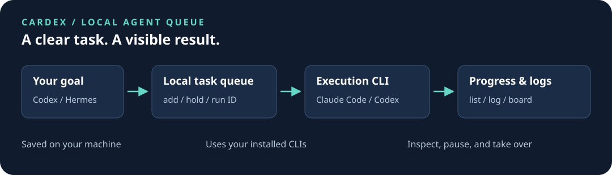

# cardex

**把开发任务交给本地 Agent 队列，随时看进度、暂停和接管。**

**中文** | [English](README.en.md) · [下载 Release](https://github.com/OttoPrua/cardex/releases/latest) · [新手配置](docs/getting-started.md) · [独立派发 Agent](docs/dispatch-agent.md)

Cardex 是本地命令行调度器：把目标或步骤保存为任务卡，调用你已经安装、登录的 Claude Code / Codex 等 CLI 执行，记录状态、日志和结果。单个 Go 二进制；调度和看板本身不调用模型，执行任务使用对应服务的额度。



## 可以做什么

| 想做的事 | 用法 |
|---|---|
| 把一个修复或功能交出去 | `add` 保存任务，`run ID` 执行指定卡 |
| 多个步骤接着做 | 用 `---` 分隔 prompt；Claude 可在同一会话续跑，其他执行器受各自适配器限制 |
| 限额后稍后继续 | 支持的执行器记录冷却时间并恢复；认证失败、结果不明等情况会暂停等待处理 |
| 知道任务跑到哪里 | `list`、`log ID`、本地 Web 看板 `board` |
| 让 Agent 帮你拆分和派发 | 使用[独立派发 Agent](docs/dispatch-agent.md)与仓内配套 skill |
| 配置多种执行器、依赖和审核 | 按需要开启高级功能，见[进阶指南](docs/guide.md)和[工作流](docs/workflows.md) |

## 从 Codex / Hermes 管理会话开始

推荐用一个独立的 **Codex 或 Hermes 会话管理任务**。Cardex 在本机保存与调度队列，各 provider CLI 执行任务；管理会话的模型和执行卡的模型可以不同。

在管理会话所在机器安装程序和配套 skill。macOS / Linux：

```sh
curl -fsSL https://github.com/OttoPrua/Cardex/releases/latest/download/install.sh -o /tmp/cardex-install.sh && sh /tmp/cardex-install.sh --manager codex
```

Windows PowerShell：

```powershell
& ([scriptblock]::Create((Invoke-RestMethod -ErrorAction Stop https://github.com/OttoPrua/Cardex/releases/latest/download/install.ps1))) -Manager codex
```

使用 Hermes 时将 `codex` 换为 `hermes`。安装器校验下载包，安装程序和 skill，盘点本机 CLI，并在输出末尾提示**当前部署 Agent 在同一对话继续配置**：确认已有订阅 → 引导所选 CLI 登录 → 展示模型/思考档/复核推荐 → 询问是否采用 → 保存预设。保留现有配置与备份。

也可以直接把下面这段发给 Agent，让它完成安装和后续引导：

```text
请按 https://github.com/OttoPrua/Cardex/blob/main/docs/getting-started.md 安装并配置 Cardex。
安装后读取 cardex-dispatch skill，在当前对话继续逐步询问我已有且希望使用的订阅，
协助完成配置，再根据实际可用模型展示推荐路由并问我是否采用。
我确认后保存，手调设置优先，后续任务直接复用；不要只停在安装成功。
```

管理 Agent 负责研究并生成建议，Cardex 不自动联网更新排名。推荐保存在本地，执行时直接复用：

```sh
cardex presets                 # 查看已保存建议
cardex add -preset routine -dry-run -dir . "阅读项目，说明入口和运行方式；不要修改文件。"
cardex add -preset routine -dir . "阅读项目，说明入口和运行方式；不要修改文件。"
cardex run TASK_ID              # 替换成 add 返回的 ID；执行并调用模型
cardex log TASK_ID
cardex board                   # http://127.0.0.1:8787
```

`routine` 需先由引导流程保存。`-dry-run` 只展示任务卡；无 ID 的 `run` 会处理整个就绪队列。CLI 最小起点仍可用 `cardex setup -runner claude` 或 `-runner codex`，再运行 `doctor`。完整步骤、手动下载、PATH、订阅和模型配置见[新手指南](docs/getting-started.md)。

源码构建需要 Go 1.24+：`go build -o cardex .`（Windows 输出 `cardex.exe`）。

## Windows 当前支持到哪里

Release 提供 Windows 原生可执行文件，但**不代表所有功能已在 Windows 完整验证**。基础配置、任务卡与调度应先按[新手指南](docs/getting-started.md#windows-使用边界)验证；真实模型执行还取决于本机 CLI、登录、权限及项目工具链。

- `install-launchd` 仅适用于 macOS；Windows 可先前台运行 `daemon`，或使用任务计划程序。
- Windows 不支持 hosted PTY Goal。
- 依赖严格进程退出证明的自动跨引擎切换不可用；原生测试范围与进程管理行为见 [Windows 说明](docs/windows.md)。
- Bash / SSH / rsync 等高级示例有额外环境要求；Windows 原生路径与 WSL 路径不要混用。

## 日常配置与操作

配置和任务默认保存在 `~/.cardex`（Windows 为用户目录下的 `.cardex`）。用 `CARDEX_ROOT` 或每条命令的 `-root` 切换数据目录。运行 `cardex setup` 可交互选择 Claude 或 Codex；需要指定 CLI 路径时用 `-bin`。既有安装请修改现有配置，勿用新手示例覆盖任务数据。

常调参数是 `max_parallel`（默认 1）、`step_timeout_min`（默认 60 分钟）和 `poll_interval_sec`（默认 300 秒）。先跑通一张卡，再调整并发或混合模型路由。Codex 初始配置沿用 Codex CLI 自己的模型设置，思考档为 `medium`；保存预设后按预设选择。高级路由和显式模型设置见[配置参考](docs/config.md)。

```sh
cardex hold TASK_ID              # 暂停该卡
cardex release TASK_ID           # 恢复排队，不等于立即执行
cardex daemon                   # 前台持续调度，Ctrl+C 退出
```

需要长期运行时，macOS 可用 `cardex install-launchd`。开启后台调度后，就绪卡可能自动执行；只想准备任务时，使用 `add -hold`。

## 独立派发 Agent

推荐把“接收需求、确定范围、创建任务卡、跟进结果”放在单独的 Agent 会话里。执行 Agent 只接收当前任务需要的目标、目录、约束和验收方式。无需先搭建复杂多 Agent 架构。

[角色提示词、三个实用案例与安装方法 →](docs/dispatch-agent.md) · [cardex-dispatch skill →](skills/cardex-dispatch/SKILL.md)

## 更多文档

| 文档 | 适合什么时候读 |
|---|---|
| [新手配置](docs/getting-started.md) | 安装、首次配置、第一张卡、排错 |
| [独立派发 Agent](docs/dispatch-agent.md) | 复制角色提示词，按案例派发任务 |
| [配置参考](docs/config.md) | 查所有配置键与 prompt 模板 |
| [进阶指南](docs/guide.md) | 装配、协调、进度回收、审核分流、额度与多引擎 |
| [推荐工作流](docs/workflows.md) | 依赖、写域、独立审核、Goal 与集成门 |
| [混合路由](MIXED_ROUTING.md) | 已有多执行器环境的精确路由；不是新手必配项 |
| [运行时内核](docs/internals.md) | 恢复、重试、权限和持久状态的实际行为 |
| [更新记录](docs/changelog.md) | 版本变化 |

长期管理会话也可按需加载 [perlica-low-token-manager](skills/perlica-low-token-manager/SKILL.md)。原项目名为 ClaudeGo；旧命令软链和数据迁移见[新手指南](docs/getting-started.md#已有安装与旧名称)。

开发检查：`go test ./...`；`make test` 运行基于 Bash 和 mock CLI 的集成测试。

## 许可

[PolyForm Noncommercial 1.0.0](LICENSE) —— **个人随便用，商用需授权**。

- **无需联系，直接用**：个人自用、学习研究、业余项目，以及慈善 / 教育 / 公共研究机构的使用。
- **需要授权**：在公司内部用于生产或交付工作、用它承接付费项目、把它或其衍生品作为产品或
  服务的一部分提供给他人。开个 [issue](https://github.com/OttoPrua/cardex/issues) 说明用途即可。

注意两点：这不是 OSI 定义的开源许可证（它对商业用途有限制），别按开源依赖直接引入贵司的
合规清单；2026-08-03 之前发布的版本（截至提交 `b1ed92b`）仍是 MIT，那部分授权不可撤销，
本次变更只对其后的版本生效。详见 [LICENSE](LICENSE)。

## 致谢

本项目在 [LINUX DO](https://linux.do) 社区分享，感谢社区佬友的反馈。
